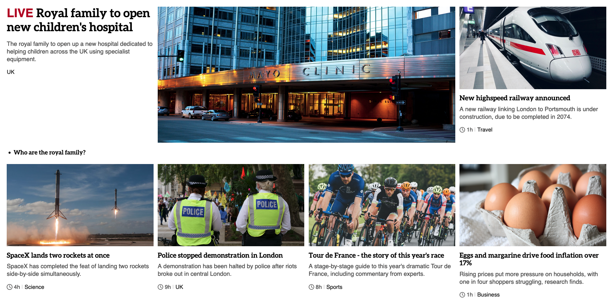

# Clone BBC NEWS using CSS Grid

This project is an exercise in cloning the BBC NEWS website using CSS Grid. Through this exercise, you can familiarize yourself with the application and syntax of CSS Grid, as well as hone your HTML and CSS skills.

## Technologies

In this project, you will learn and use the following technologies:

HTML5: Used to build webpage structure and content
CSS3: Used to design webpage appearance and layout, including CSS Grid, Flexbox, media queries, etc.

## Requirements

To complete this project, you need to have the following skills:

Basic knowledge of HTML and CSS
Familiarity with CSS Grid technology
Understanding of how to use media queries
Proficiency in using an editor such as VS Code

## Contributions

If you find any errors or issues, or have any suggestions for improvement, please feel free to raise issues or send pull requests. We welcome any contributions and suggestions.

## Demo

